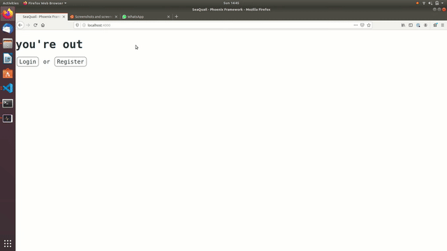
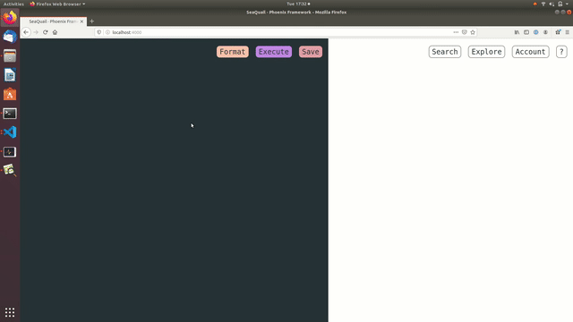

# SeaQuail

- **Description**: A lightweight web based SQL editor for analysts
- **Status**: Under development

### Run SQL and see a chart immediately alongside the raw data

### Save queries and explore tables and columns in the database

# Setup

1. Clone the repo
2. `mix deps.get`
3. `cd assets && npm install && cd ..`
4. `cp .env.example .env`
